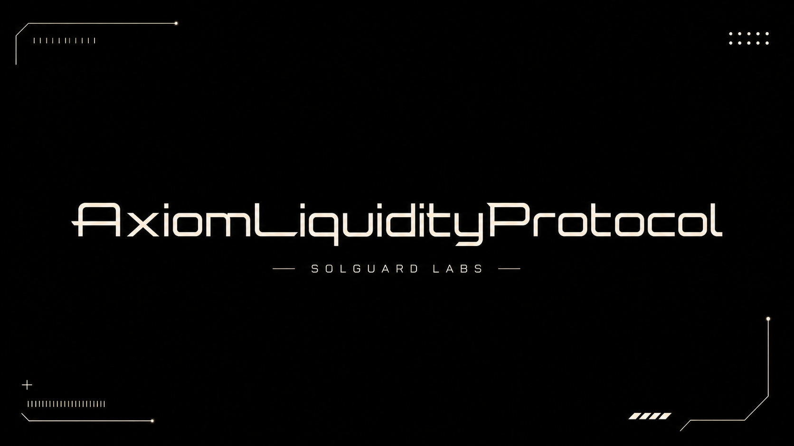
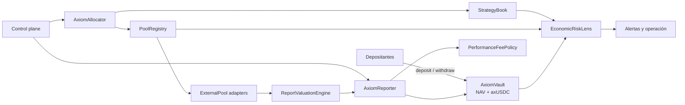
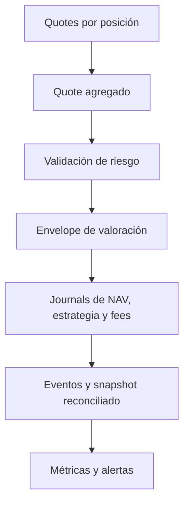

<p align="center">
  
</p>

<p align="center">
  <a href="https://github.com/SolguardLabs/AxiomLiquidityProtocol/actions/workflows/ci.yml"></a>
  <a href="https://github.com/SolguardLabs/AxiomLiquidityProtocol/releases"></a>
  
  
  <a href="./LICENSE"></a>
</p>

# AxiomLiquidityProtocol

Axiom es un motor de liquidez gestionada para vaults de un único activo. Coordina depósitos,
shares, estrategias multivenue, rangos de precio, reportes de NAV, comisiones de rendimiento,
retiradas y límites operativos mediante contabilidad determinista con enteros escalados.

La versión `1.0.0` incorpora una superficie gobernada para operaciones privilegiadas, valoración
estructurada de reportes y un modelo de estrés que cuantifica pérdida esperada, concentración,
cobertura de liquidez y precio de la participación bajo escenarios adversos.

## Capacidades

- Emisión y quema proporcional de `axUSDC` sobre NAV actualizado.
- Asignación por estrategia, venue y rango con límites en basis points.
- Quotes separados de valor marcado y valor de salida.
- Cristalización de performance fees con high watermark por estrategia.
- Recall de liquidez gestionada para atender retiradas.
- Roles de gobierno, asignación, reporting y guardianía.
- Pausas independientes para asignaciones y reportes.
- Stress testing y reconciliación de accounting sin mutar el estado.
- Eventos suficientes para reconstruir cada transición económica.

## Arquitectura



`AxiomProtocol` compone el dominio. `AxiomControlPlane` es el límite recomendado para servicios
que ejecutan acciones privilegiadas. Las lecturas se obtienen mediante `ProtocolLens` y
`EconomicRiskLens`.

## Modelo económico

Todos los importes usan seis decimales y todas las proporciones usan basis points.

```text
NAV = idleAssets + managedAssets

sharesMinted = depositAssets × totalShares / NAV
assetsRedeemed = sharesBurned × NAV / totalShares

optimisticValue = principal + pendingFees + temporaryPremium
exitValue = max(optimisticValue - unrealizedLoss - exitPenalty, 0)
```

El modelo de estrés aplica una cascada ordenada sobre los activos gestionados:

```text
managed₁ = managed × (1 - marketLossBps)
managed₂ = managed₁ × (1 - liquidityHaircutBps)
managed₃ = managed₂ × (1 - exitPenaltyShockBps)
stressedNAV = idleAssets + managed₃
expectedShortfall = NAV - stressedNAV
```

La explicación completa, incluidos high watermark, confianza de valoración y ejemplos numéricos,
está en [docs/economic-model.md](./docs/economic-model.md).

## Ciclo de un reporte



El ciclo se ejecuta de forma síncrona. Si una validación falla, no debe publicarse un snapshot
parcial en la capa de aplicación.

## Inicio rápido

Requisitos:

- Node.js 24 o superior.
- Bun 1.3.14.

```bash
bun install --frozen-lockfile
bun run test
bun run typecheck
bun run ci
bun run demo
```

`bun run ci` valida tipos, formato, tamaño del código fuente y todos los tests Node.

## Ejemplo de integración

```ts
import {
    AxiomControlPlane,
    DEFAULT_STRESS_SCENARIO,
    allocatedProtocol,
    asset,
} from "@solguardlabs/axiom-liquidity-protocol";

const protocol = allocatedProtocol();
const controls = new AxiomControlPlane(protocol, "governor");

controls.grantRole("governor", "allocator", "allocator-service");
controls.allocate("allocator-service", {
    strategyId: "stable-range-alpha",
    poolId: "curve-usdc-usdt",
    rangeId: "stable-tight",
    amount: asset(25_000),
});

const risk = protocol.economicRisk.evaluate(DEFAULT_STRESS_SCENARIO);
console.log(risk.stressedNav, risk.expectedShortfallBps, risk.flags);
```

Para un servicio persistente, construye una única instancia del control plane, guarda sus roles en
configuración gobernada y serializa las mutaciones por vault.

## Señales operativas

`EconomicRiskLens` puede devolver:

| Señal                         | Interpretación                                            |
| ----------------------------- | --------------------------------------------------------- |
| `ACCOUNTING_GAP`              | El managed NAV no reconcilia con los books de estrategia. |
| `IDLE_BUFFER_LOW`             | La liquidez idle cae por debajo de la política del vault. |
| `STRATEGY_CONCENTRATION_HIGH` | Una estrategia supera el límite de concentración.         |
| `STRESS_LOSS_HIGH`            | El shortfall del escenario rebasa el umbral operativo.    |
| `STRATEGY_REPORT_STALE`       | Existe exposición con un reporte demasiado antiguo.       |

Las señales son combinables: `healthy` solo es `true` cuando el vector está vacío.

## Documentación

- [Arquitectura](./docs/architecture.md)
- [Modelo económico](./docs/economic-model.md)
- [Estrategias y reporting](./docs/strategy-lifecycle.md)
- [Riesgo y seguridad](./docs/risk-and-security.md)
- [Operación](./docs/operations.md)
- [Integración](./docs/integration.md)
- [Política de seguridad](./SECURITY.md)
- [Historial de cambios](./CHANGELOG.md)

## Versionado

Las versiones estables siguen SemVer. El tag `v1.0.0`, la rama `production` y el release
`Production 1.0.0` representan el mismo commit verificable.

## Licencia

Distribuido bajo [MIT](./LICENSE).
