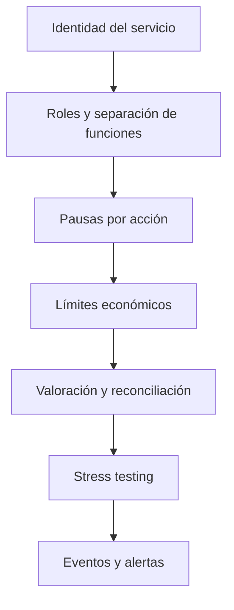

# Política de seguridad

## Versiones mantenidas

| Versión   | Estado      |
| --------- | ----------- |
| `1.0.x`   | Mantenida   |
| `< 1.0.0` | Sin soporte |

## Comunicación responsable

Los hallazgos deben enviarse mediante un
[aviso privado de seguridad](https://github.com/SolguardLabs/AxiomLiquidityProtocol/security/advisories/new).
No publiques detalles técnicos en issues, pull requests o discusiones abiertas antes de que exista
una corrección coordinada.

Incluye:

- versión o commit afectado;
- precondiciones y estado inicial mínimo;
- transición económica observada;
- impacto cuantificado sobre NAV, shares o retiradas;
- reproducción determinista;
- propuesta de tests de regresión.

## Fronteras de confianza

- `AxiomControlPlane` autentica operaciones privilegiadas en la capa de aplicación.
- Los gobernadores administran roles, límites y reanudaciones.
- Los guardianes solo pueden pausar acciones controladas.
- Los asignadores mueven capital dentro de políticas ya configuradas.
- Los reporteros autorizados publican estados de estrategias registradas.
- Los adaptadores de pools son fuentes de valoración externas y deben tratarse como datos no
  confiables hasta superar validación.
- Los depositantes dependen de la exactitud del NAV y del supply de shares.

El motor de dominio es una biblioteca en memoria; una integración de red debe aportar persistencia,
autenticación fuerte, exclusión mutua e idempotencia alrededor del control plane.

## Invariantes económicas

```text
totalAssets = idleAssets + managedAssets
managedAssets = Σ strategy.accountedValue
totalShares = Σ account.shareBalance
```

Además:

- un depósito se cotiza contra el NAV anterior a su entrada;
- una retirada quema shares antes de liberar activos;
- un recall no puede reducir más managed NAV del contabilizado;
- los límites de estrategia, pool y rango se aplican antes de asignar;
- cada importe monetario usa `bigint` y escala fija;
- cada porcentaje se valida dentro de `[0, 10_000]` bps;
- los cambios de roles y pausas generan eventos reconstruibles;
- un snapshot operativo debe exponer cualquier gap de accounting distinto de cero.

## Capas de control



Los controles son acumulativos. Superar una capa no evita las validaciones posteriores.

## Operación segura

- Ejecuta mutaciones mediante una cola serializada por vault.
- Usa identificadores idempotentes en la capa que reciba peticiones de red.
- Rechaza timestamps fuera de la ventana operativa acordada.
- Mantén cuentas distintas para gobierno, guardianía, asignación y reporting.
- Verifica `ACCOUNTING_GAP == 0` antes y después de cada lote.
- Pausa nuevas asignaciones si el idle buffer o el shortfall exceden la política.
- Conserva eventos y snapshots en almacenamiento append-only.
- Ancla releases operativos al mismo SHA en `main`, `production` y el tag estable.

## Validación automatizada

El gate ejecuta:

```bash
bun install --frozen-lockfile
bun run ci
```

La suite cubre accounting de vault, asignaciones, reports, pérdidas, retiradas, roles, pausas,
valoración, reconciliación y estrés económico. CI también verifica que el tag coincida con la
versión declarada en `package.json`.

## Dependencias y cadena de suministro

- No existen dependencias de runtime.
- Bun instala el lockfile exacto con `--frozen-lockfile`.
- Dependabot revisa npm y GitHub Actions semanalmente.
- Las Actions reciben únicamente permiso de lectura sobre contenidos.
- Los binarios y artefactos generados no se versionan.

## Alcance

Dentro de alcance:

- conversiones entre activos y shares;
- valoración, NAV y high watermarks;
- asignación, recall y retiradas;
- roles, pausas y límites;
- modelos de estrés y alertas;
- integridad de eventos y snapshots.

Fuera de alcance:

- disponibilidad de proveedores externos;
- seguridad del sistema operativo del integrador;
- credenciales añadidas por una aplicación consumidora;
- pérdidas producidas por parámetros de riesgo aprobados explícitamente por gobierno.
