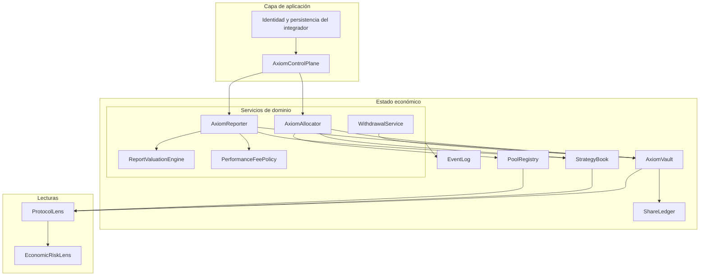
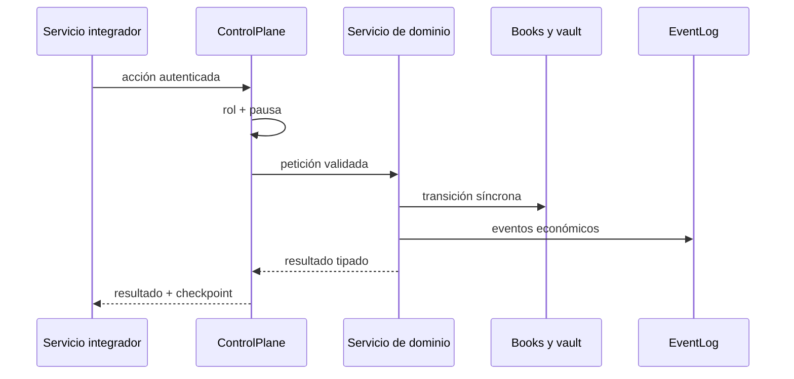

# Arquitectura

## Vista general

Axiom separa ledger, books de estrategia, adaptadores de venue, servicios mutables y superficies
de lectura. La composición se realiza en `AxiomProtocol`; el estado no depende de singletons ni de
servicios de red.



## Componentes

### `AxiomVault`

Mantiene `idleAssets`, `managedAssets` y el supply de shares. Es responsable de:

- cotizar depósitos y redenciones;
- mover saldo entre idle y managed;
- aplicar revaloraciones;
- acuñar shares asociadas a fees;
- quemar shares al liberar efectivo.

No conoce posiciones, rangos ni venues.

### `StrategyBook`

Conserva políticas y accounting por estrategia:

```text
principal
accountedValue
highWatermark
cumulativeFees
cumulativeLosses
cumulativeWithdrawals
lastReportAt
```

El book no posee activos; representa la atribución del managed NAV.

### `PoolRegistry` y `ExternalPool`

`PoolRegistry` resuelve cada posición hacia su venue. `ExternalPool` mantiene principal, fees,
premium temporal, pérdidas y parámetros de salida. Sus quotes contienen valor marcado y valor de
salida para que las políticas posteriores puedan trabajar con ambos.

### Servicios

- `AxiomAllocator`: valida capacidad y abre o incrementa posiciones.
- `AxiomReporter`: coordina quote, riesgo, valoración, journals y eventos.
- `WithdrawalService`: calcula liquidez necesaria y solicita recalls cuando el idle es insuficiente.
- `PerformanceFeePolicy`: aplica high watermark y fee bps.
- `ReportValuationEngine`: normaliza un reporte en un envelope inmutable.

### Lecturas

`ProtocolLens` agrega snapshots sin mutar estado. `EconomicRiskLens` consume esos snapshots para
ejecutar reconciliación y escenarios adversos.

## Fronteras de mutación



El integrador debe serializar acciones por vault. Las clases no implementan locks distribuidos ni
persistencia transaccional.

## Determinismo

- Dinero: `bigint` con `ASSET_SCALE = 1_000_000`.
- Shares: `bigint` con `SHARE_SCALE = 1_000_000`.
- Ratios: basis points sobre `BPS = 10_000`.
- Redondeo: hacia abajo para depósitos y redenciones; hacia arriba al acuñar shares equivalentes a
  una cantidad de fee.
- Tiempo: se acepta como parámetro para tests y reproducción; `Date.now()` es solo el valor por
  defecto.

## Extensión

Un nuevo venue debe implementar su traducción a `PoolQuote`. Un nuevo modelo de riesgo debe
consumir snapshots o envelopes y mantenerse read-only salvo que represente una política de
admisión explícita.
