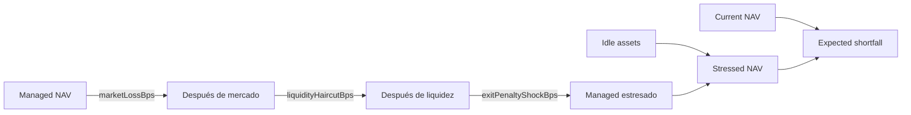

# Modelo económico

## Unidades

Axiom usa enteros de precisión fija:

```text
1 USDC = 1,000,000 unidades
1 axUSDC = 1,000,000 unidades de share
100 % = 10,000 bps
```

Los cálculos no convierten dinero a `number`.

## NAV y shares

```text
NAV = idleAssets + managedAssets
managedAssets = Σ accountedValue(strategy)
shareSupply = Σ shareBalance(account)
```

Para un vault inicial:

```text
sharesMinted = depositAssets
```

Con supply existente:

```text
sharesMinted = floor(depositAssets × shareSupply / NAV)
assetsOut = floor(sharesBurned × NAV / shareSupply)
```

La cotización del depósito ocurre antes de añadir el nuevo efectivo al NAV. Una retirada se vuelve
a cotizar después de cualquier recall necesario.

## Valor de una posición

Cada posición separa los siguientes buckets:

```text
P = principal
F = pending fees
M = temporary premium
L = unrealized loss
E = exit penalty
```

```text
optimisticValue = P + F + M
exitValue = max(P + F + M - L - E, 0)
valuationGap = max(optimisticValue - exitValue, 0)
confidenceBps = floor(exitValue × 10,000 / optimisticValue)
```

El quote agregado suma los buckets de todas las posiciones de la estrategia. No se promedian
ratios por posición porque eso perdería el peso económico de cada exposición.

## High watermark y fee shares

Cada estrategia mantiene un high watermark `H` y una tasa `f` limitada por política:

```text
grossGain = max(feeReferenceValue - H, 0)
feeAssets = floor(grossGain × f / 10,000)
feeShares = ceil(feeAssets × shareSupply / NAV)
```

La acuñación usa redondeo hacia arriba para no infravalorar el importe contable de la fee. El
resultado se registra tanto en el vault como en `cumulativeFees` de la estrategia.

## Waterfall de estrés

El stress model aplica shocks secuenciales; cada porcentaje actúa sobre el saldo restante, no
sobre el managed NAV original.



Formalmente:

```text
marketLoss = managed₀ × m
managed₁ = managed₀ - marketLoss

liquidityHaircut = managed₁ × h
managed₂ = managed₁ - liquidityHaircut

exitPenaltyShock = managed₂ × e
managed₃ = managed₂ - exitPenaltyShock

stressedNAV = idle + managed₃
expectedShortfall = NAV - stressedNAV
```

## Ejemplo numérico

Supuestos:

```text
idleAssets = 260,000
managedAssets = 540,000
shareSupply = 800,000
marketLoss = 5 %
liquidityHaircut = 2.5 %
exitPenaltyShock = 1 %
```

Resultado:

```text
managed₁ = 513,000
managed₂ = 500,175
managed₃ = 495,173.25
stressedNAV = 755,173.25
expectedShortfall = 44,826.75
shortfallBps ≈ 560
stressedPPS ≈ 0.943966
```

La composición secuencial evita contar dos veces el mismo notional.

## Concentración y cobertura

```text
idleCoverageBps = idleAssets × 10,000 / NAV
strategyAllocationBps = strategy.accountedValue × 10,000 / NAV
largestStrategyAllocationBps = max(strategyAllocationBps)
```

El modelo compara cobertura y concentración con la configuración del vault y del
`RiskController`. Una señal no modifica posiciones; comunica una condición operativa para que el
control plane o el runbook decidan.

## Reconciliación

```text
accountingGap = abs(vault.managedAssets - Σ strategy.accountedValue)
```

El valor esperado es cero. Un gap indica una transición incompleta, una integración que escribió
fuera del servicio previsto o una restauración de estado incoherente.

## Propiedades verificables

- `stressedNAV <= currentNAV` para shocks no negativos.
- `expectedShortfall = marketLoss + liquidityHaircut + exitPenaltyShock`.
- `stressedPricePerShare <= currentPricePerShare` con supply constante.
- El stress model no modifica vault, books, posiciones ni eventos.
- Un depósito seguido de una retirada sin cambios de NAV pierde como máximo el redondeo acotado.
