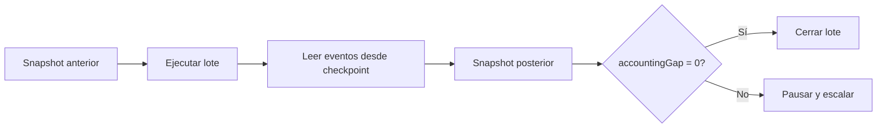

# Operación

## Gate de despliegue

Antes de promover una versión:

```bash
bun install --frozen-lockfile
bun run ci
```

Verifica además:

- `main`, `production` y `vX.Y.Z` apuntan al mismo commit;
- el release no es draft ni prerelease;
- `Release integrity` termina correctamente;
- no existen cambios locales ni dependencias fuera del lockfile.

## Cadencia de observación

| Frecuencia   | Comprobación                                          |
| ------------ | ----------------------------------------------------- |
| Cada lote    | `accountingGap`, eventos y supply de shares.          |
| Cada minuto  | Idle coverage, concentración y pausas.                |
| Cada reporte | Calidad, confianza, gap y pérdida realizada.          |
| Cada hora    | Escenario base y escenario severo.                    |
| Diaria       | Edad de reportes, dependencias y capacidad de salida. |

## Reconciliación de un lote



Conserva:

- hash o versión del estado anterior;
- petición y actor;
- resultado tipado;
- rango de event ids;
- snapshot posterior;
- evaluación económica.

## Runbook: accounting gap

1. Pausar `allocation` y `reporting`.
2. Bloquear nuevos lotes en la persistencia.
3. Comparar `vault.managedAssets` con `StrategyBook.totalAccountedValue()`.
4. Revisar eventos desde el último checkpoint correcto.
5. Identificar la transición incompleta.
6. Restaurar desde snapshot o aplicar un journal gobernado.
7. Ejecutar suite y reconciliación.
8. Reanudar únicamente desde gobierno.

## Runbook: liquidez idle baja

1. Detener asignaciones nuevas.
2. Proyectar retiradas pendientes.
3. Ordenar posiciones por valor de salida y penalización.
4. Ejecutar recalls acotados.
5. Recalcular NAV y stress model después de cada reducción.
6. Mantener reporting activo salvo señal contable adicional.

## Runbook: reporte stale

1. Identificar estrategias con exposición y `lastReportAt` vencido.
2. Bloquear incrementos para esas estrategias.
3. Obtener quotes de todos los venues.
4. Publicar el reporte mediante actor autorizado.
5. Comprobar confianza, gap, límites y nuevo stress snapshot.

## Backups

Los snapshots deben incluir vault, shares, estrategias, pools, roles, pausas y último event id. Una
restauración se valida ejecutando reconciliación antes de abrir mutaciones.
