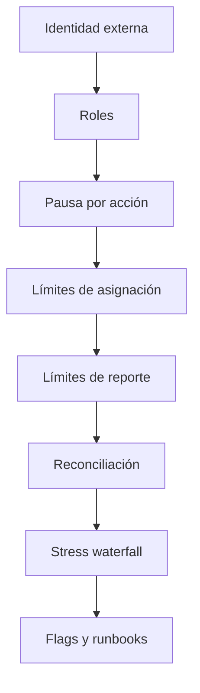
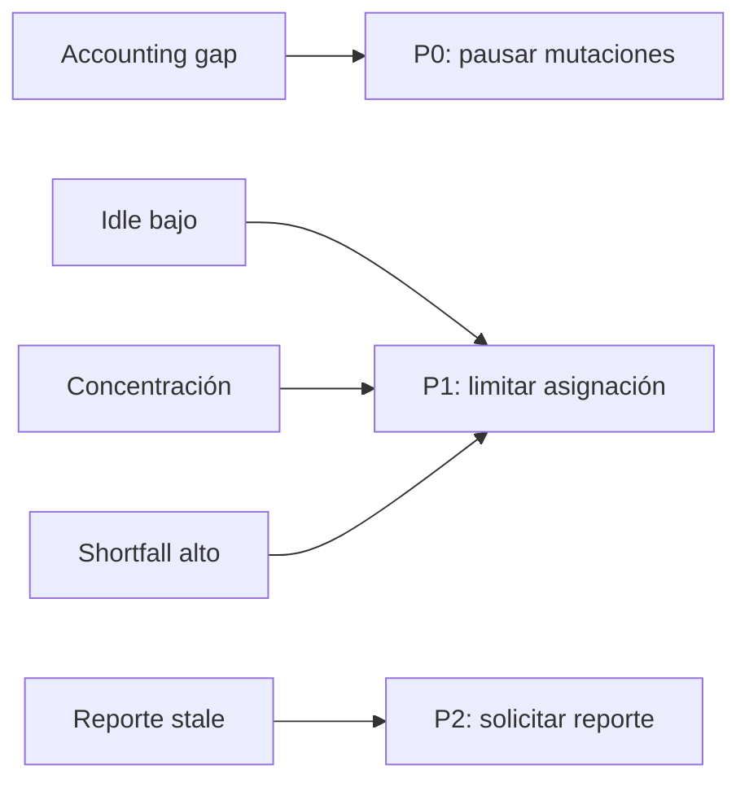

# Riesgo y seguridad

## Defensa por capas



La autenticación de red pertenece al integrador. Axiom recibe una identidad ya autenticada y
aplica autorización económica mediante `AxiomControlPlane`.

## Roles

| Rol         | Capacidades                                                            |
| ----------- | ---------------------------------------------------------------------- |
| `governor`  | Conceder/revocar roles, cambiar límites, asignar, reportar y reanudar. |
| `guardian`  | Pausar asignaciones o reportes.                                        |
| `allocator` | Ejecutar asignaciones aprobadas.                                       |
| `reporter`  | Publicar reportes de estrategias.                                      |

El estratega configurado puede reportar su propia estrategia. El último gobernador no puede
revocarse.

## Pausas

Las pausas son independientes:

- `allocation`: bloquea capital nuevo hacia posiciones;
- `reporting`: bloquea nuevos journals de estrategia.

Una guardianía puede activar la pausa. Solo gobierno puede retirarla. Depósitos y retiradas no se
pausan desde este control porque tienen su propio tratamiento en la aplicación integradora.

## Límites cuantitativos

`RiskLimits` controla:

```text
maxStrategyAllocationBps
maxPoolAllocationBps
maxRangeWidthBps
maxReportLossBps
maxStrategistFeeBps
minRangeLiquidity
maxOpenPositionsPerStrategy
maxPoolExitPenaltyBps
```

Los límites se verifican antes de la mutación correspondiente. Una actualización inválida falla
antes de quedar disponible para operaciones posteriores.

## Matriz de señales



| Flag                          | Acción inicial                                         |
| ----------------------------- | ------------------------------------------------------ |
| `ACCOUNTING_GAP`              | Pausar allocation/reporting y reconciliar journals.    |
| `IDLE_BUFFER_LOW`             | Detener nuevas asignaciones y proyectar recalls.       |
| `STRATEGY_CONCENTRATION_HIGH` | Reducir exposición o elevar gobierno explícito.        |
| `STRESS_LOSS_HIGH`            | Revisar parámetros y capacidad de salida.              |
| `STRATEGY_REPORT_STALE`       | Solicitar reporte y bloquear incremento de exposición. |

## Invariantes de autorización

- Una cuenta sin rol no ejecuta acciones privilegiadas.
- Guardianía no reanuda operaciones.
- Ningún actor elimina el último gobernador.
- Una pausa se aplica antes de entrar al servicio mutable.
- Todo cambio de rol o pausa emite un evento.

## Invariantes de accounting

- `accountingGap == 0` al cerrar cada lote.
- `totalShares` coincide con la suma de balances.
- `managedAssets` coincide con el total de estrategias.
- Un recall nunca reduce más valor del accounted.
- Una retirada nunca entrega más idle del disponible.

## Integración persistente

La capa que persista estado debe envolver cada acción en una transacción optimista o lock por
vault. Guarda el último event id como checkpoint y rechaza reintentos con una clave idempotente ya
consumida.
