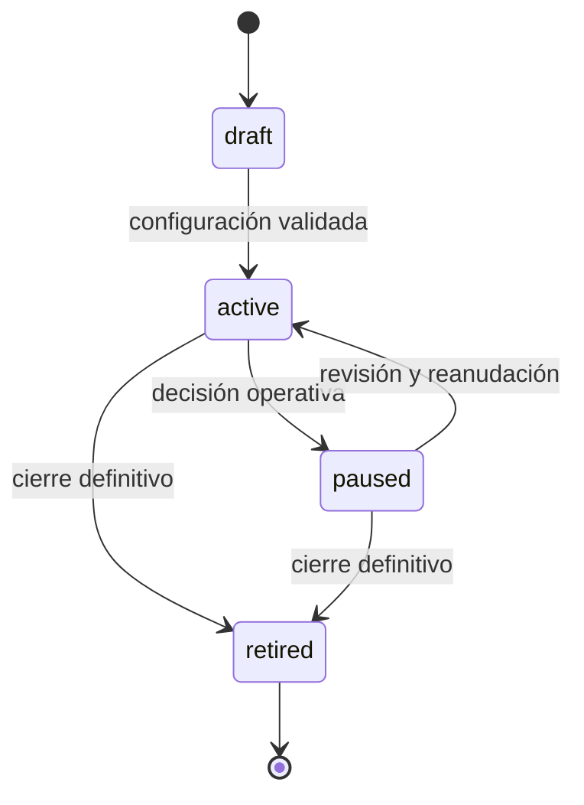
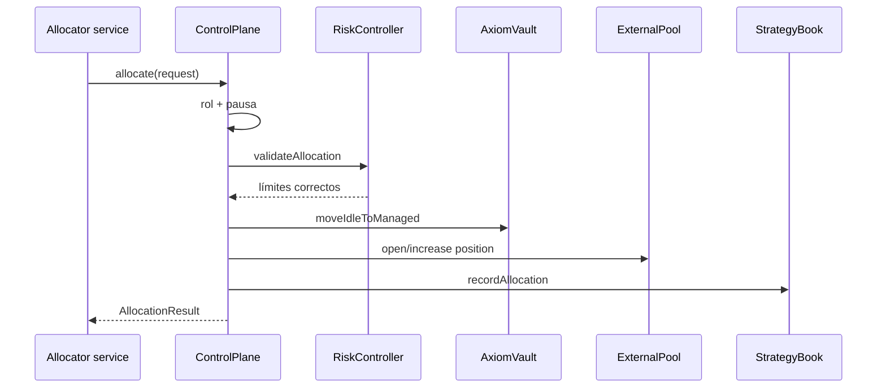

# Ciclo de estrategias

## Estados

Una estrategia transita entre `draft`, `active`, `paused` y `retired`. Las asignaciones solo se
aceptan en estado activo; los reportes de una estrategia retirada se rechazan.



## Creación

`createStrategy` registra:

- identidad y etiqueta;
- estratega y destinatario de fees;
- tasa de rendimiento;
- capacidad máxima;
- allowlist de pools;
- rangos con pesos objetivo;
- política de reportes fuera de rango.

El `RiskController` valida fee, capacidad y ancho de rangos antes de emitir eventos.

## Asignación



Validaciones relevantes:

- estrategia activa;
- pool permitido;
- saldo idle suficiente;
- mínimo por rango;
- capacidad de estrategia;
- concentración de pool;
- número máximo de posiciones.

## Reporting

Un reporte agrega quotes de todas las posiciones. El `ReportValuationEngine` produce un envelope
inmutable con valor reportado, valor ajustado, gap, confianza y calidad. Los journals actualizan
vault y estrategia y emiten un resumen tipado.

Calidades disponibles:

| Calidad       | Condición                                            |
| ------------- | ---------------------------------------------------- |
| `observable`  | No existe gap entre mark y salida.                   |
| `estimated`   | Existe un ajuste sin pérdida no realizada explícita. |
| `stressed`    | El quote incorpora pérdida no realizada.             |
| `unavailable` | La estrategia no tiene posiciones cotizables.        |

El timestamp del reporte alimenta la detección de exposición stale.

## Recall

Cuando una retirada requiere más activos que el idle disponible, `AxiomAllocator.recall` reduce
posiciones y devuelve su valor de salida. El vault registra por separado:

```text
accountedReduction
returnedAssets
delta = returnedAssets - accountedReduction
```

Si el valor retornado es menor, la diferencia se registra como pérdida acumulada.

## Retirada

1. Verificar balance de shares y límite por petición.
2. Cotizar activos con el NAV actual.
3. Ejecutar recall si falta idle.
4. Volver a cotizar después del recall.
5. Quemar shares.
6. Liberar activos y emitir `vault.withdraw`.

La segunda cotización es necesaria porque un recall puede realizar pérdidas y cambiar el NAV.

## Retiro de una estrategia

Antes de marcar una estrategia como `retired`:

- cerrar o recordar todas las posiciones;
- reconciliar `accountedValue` con cero;
- comprobar que no quedan withdrawals en tránsito;
- capturar un snapshot de riesgo;
- conservar el último checkpoint y eventos asociados.
